# Batch 1 - Aug to Dec 2019

- [Mentors](#mentors)
- [Mentees](#mentees)

## Mentors

### Alwyn Tan

**Senior Software Engineer, [Open Government Products](https://open.gov.sg)**

<https://github.com/LoneRifle>

<https://www.linkedin.com/in/alwynt>

---

### Andrew Fam

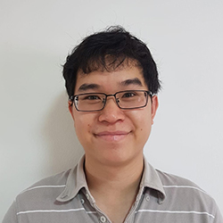

**CTO, Straits Interactive**

I’m currently the CTO of Straits Interactive and I build enterprise software tools that help companies manage their privacy compliance efforts across the region.
Some of the companies currently include Samsung, Changi Airport, IKEA, Loreal and the Data Protection Commission of Ghana.
In my current stint I've successfully deployed projects that involve a wide range of technologies including blockchain, VR, HTML5 games, ML and chatbots.

Personally, I’ve been doing tech for about 6 years since graduating from NUS with a degree in Chemistry.
Learnt all that I know by starting from simple HTML websites and progressing through Wordpress & Drupal to finally settling on Python / Django.
Founded 2 startups and helped many more build their MVPs through doing side projects.
Had my first mini exit when a startup I worked with was acquired by a Japanese company.

I bring to the table a wealth of experience developing enterprise solutions across different industries.
Having dabbled in different tech, I can advise too on what are the current hypes and how to properly leverage them to build solutions that can be commercialised.

<https://www.linkedin.com/in/andrew-fam-cipt-1029784b/>

---

### Brecht Missotten

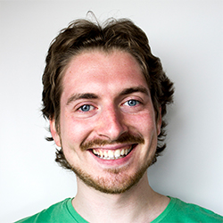

**Senior Frontend Developer, Red Airship**

Brecht Missotten is a senior front-end developer currently working at Red Airship. His story starts more than 15 years ago when he got his first access to the world wide web. Initially, he taught himself to create 3D graphics and animation but soon wanted to share his trial and error with the world. It wasn't long until he realised that frontpage doesn't cut it and that's where his career as a developer started. He tried a few different programming languages but in recent years he prefers to focus on the front-end. Before moving to work and live in Singapore he was teaching and guiding students in Belgium.

His mentoring can be technical related, but he prefers to put the focus on soft skills and guidance.

<https://www.linkedin.com/in/brechtmissotten/>

---

### Brendan Graetz

**Founder, DApps Dev Club**

Brendan designs, develops, and ensures code quality for highly scalable back end servers, using mostly NodeJs.

He also runs the decentralised applications development club, a book club style tech meetup that teaches participants how to build applications using distributed ledger technology.

- <http://bguiz.com/>
- <https://dappsdev.org/>
- <https://www.linkedin.com/in/brendangraetz/>

---

### HengHong Lee

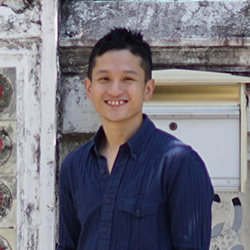

**Software Engineer, Beam**

Henghong is a former software engineer at facebook working on messenger. He's particularly excited to help engineers learn more about their careers or work on solving complex problems with good software design

<https://www.linkedin.com/in/heng-hong-lee-8938373b/>

---

### Henry Suryawirawan

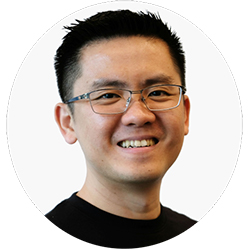

**Strategic Cloud Engineer, Google**

Henry currently works as a Strategic Cloud Engineer helping Google's most strategic clients to deploy GCP solutions from inception to production. He comes from Application Development background and is highly experienced in Agile, DevOps, Continuous Delivery, and Cloud. Henry has a diverse experience working in consulting, startup, government, banking and insurance domains. Before Google, Henry worked at ThoughtWorks helping Singapore GovTech to build and deliver several Singapore Smart Nation initiative projects. Henry was also the Head of Engineer during his startup days helping the company to build AI-based business analytics platform. Henry is the creator of Beam Katas, a set of interactive coding exercises to learn about Apache Beam concepts and programming model hands-on.

<https://www.linkedin.com/in/henry-suryawirawan/>

---

### Isha Tripathi

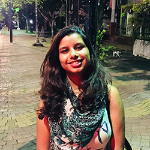

**Senior Consultant, Mavericks Consulting**

Isha is a Developer and Agile Consultant with Mavericks Consulting. She comes from an Electronics and Communications background and ended up in IT quite by accident. She has been a developer, business analyst, technical trainer, and full-time consultant. Through this program she hopes to help new developers find their place in the industry and learn from the learnings of others.

<https://www.linkedin.com/in/isha-tripathi-00914944/>

---

### Max Ong Zong Bao

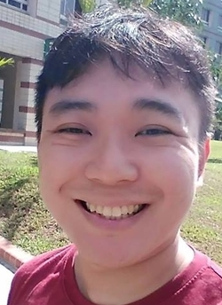

**Full Stack Developer, MicroSec Pte Ltd**

Max is a **life enhancer** for tech & entrepreneurship. Which seeks to **blend** both to build innovative products or services for the world that solves hard problems.

Max develops website, APIs using both **Flask** and **Django** for a living in a local deep tech Singapore based startup called **"MicroSec"** which builds end to end security software for IoT devices.

<https://www.linkedin.com/in/maxongzb/>

---

### Purnima Kamath

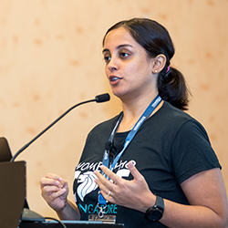

**Software Engineer, Director Women Who Code Singapore, Evangelist YOW! Conference**

More than a decade experience building enterprise level web applications, building and managing teams, architecting solutions, and selecting technology stacks. Currently working on building communities advocating diversity, engaging developers by organizing and speaking at meetups and conferences in the city.

<https://www.linkedin.com/in/purnimakamath/>

---

### Ryan Tan

**CTO, Red Airship Holdings Pte. Ltd**

<https://www.linkedin.com/in/ryantanzh/>

---

### See Yishu

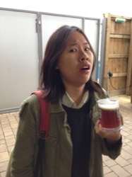

**Senior Software Engineer, Carousell**

Yishu is a software engineer at Carousell, currently contributing to the web platform. Previously she has built and managed teams, inherited classes as an iOS engineer and fleetingly a ~~pixel mover~~ product designer. She's particularly excited about rebasing, processes and pondering on growth as a software human.

<https://www.linkedin.com/in/yishu-see/>

---

### Sheldon Cheng

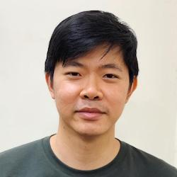

**Senior Software Engineer, NTUC Link**

Sheldon is a Front-end Developer at NTUC Link. An aspiring designer who stumbled upon the world of front-end development, he finds it a most rewarding discipline as it allows him to combine design-sensibilities with engineering-knowhow, playing on a synergy between two domains that cannot be found in any other role.

A decade and a half later, Sheldon has crafted web interfaces at UX-focused digital agencies, a mature local startup, and enterprise companies undergoing digital transformation. He tries to be good at UX/Design and Javascript at the same time, and now hopes to help guide those treading a similar path. More recently he has worked on scaling his expertise through Design Systems, and been building apps with ReactJS.

<https://www.linkedin.com/in/shldn/>

---

### Subhransu Behera

**Principal Software Engineer, SPGroup**

Subh works as a Principal Software Engineer in the R&D team at SP Digital. Before joining SP, he has worked at several product companies like PayPal, SAP and Red Hat as well as smaller startups where he was the first hire. In last 14 years he has tried several technologies but spent most part of his career building iOS apps. He is also the founder of iOS meetup group and iOS Conference in Singapore. In his free time he loves to play piano, teach how nature works to his daughter and loves to meet and learn about other developers.

Subh believes everyone has abilities to achieve remarkable things in their lives. However, some needs guidance and some needs a little push. Through this mentoring program, he hopes he can help someone realize his or her full potential.

<https://www.linkedin.com/in/subhransubehera/>

---

### Tai Shi Ling

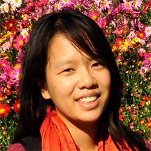

**CEO, UI-licious**

I'm Shi Ling, currently the CEO and co-founder of UI-licious, a startup that builds developer tools to test user interfaces for web applications. I graduated from Singapore Management University with a degree in Information Systems. While most of my university peers chose a job in large corporations, I decided to work in a startup in my first job as a full-stack web developer in order to not be limited by any specialisation - I moved from working on analytics, to back-end development, system administration, and front-end development. For me, I found my sweet spot in front-end development, because the reason why I chose to be an engineer, which is to build things for people. Working in front-end brings me closest to the users, at a startup, you need to wear many hats, including customer support and product design. I've also always enjoyed teaching, and had been a teaching assistant through my four years in university for engineering courses. Though these days I spend most of my time working on documenting design and technical specs to educate and communicate ideas to junior developers in my team. AMA about software engineering, quality management, design, and communication.

<https://www.linkedin.com/in/shi-ling-tai-16679147/>

---

### William Haw

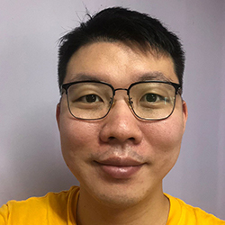

**Software Engineer, Agoda**

Hi, I'm William. I've been working as a software engineer for nearly 4 years now, first in a tiny 4 man startup and now in a large tech company.

My core skill is the design and architecture of distributed systems, mainly within the Java ecosystem. I've also been programming in Scala at work for a year now.

I also have a good understanding of what it takes to deploy my apps into production and other DevOps best practices like building CI/CD pipelines.

Other than these, please feel free to ask me anything about object oriented programming, design patterns, databases, message queues, cloud computing and, dare I say, soft skills.

P.S. A pretty detailed list of what I know (and don't know) can be found here: <https://williamhaw.com/everything-i-know-about-development-2019/>

<https://www.linkedin.com/in/william-haw-b3902115b/>

---

### Yue Lin Choong

**Director, Women Who Code Singapore**

<https://www.linkedin.com/in/ychoong/>

---

## Mentees

### Andrew Thian

**Front-end engineer, 99.co**

---

### Benny Lee Jung Thai

**Software Engineer, Yuvo Pte Ltd**

---

### Brian Teh Joo Tong

**Software Engineer, Asteria Corporation**

---

### Daniel Choo

**Student, General Assembly**

---

### David Lam

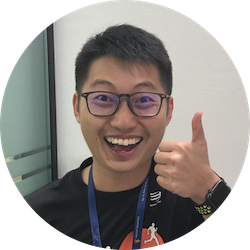

**Senior Application Analyst, Singapore Airlines**

Hi, I'm David. I work as a mobile developer (iOS) for most of my career in tech. Before working as a developer, I was a student in Nanyang Technological University studying the fascinating world of propulsion and aerodynamics. Currently, I'm working in Singapore Airlines. I love the idea of clean code, but admittedly I do not always produce it. Hopefully we can all learn to be better, together. :)

---

### Foo Shilong

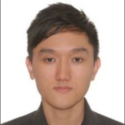

**Business analysis, Credit agricole**

Just graduated from a non-cs degree, working as a business analyst in a bank. Self studying front end since Jan19. Would love to hear from self taught mentors who knows the way. Love dogs.

---

### Goh Hong Yi

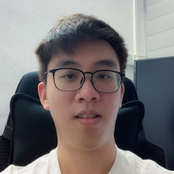

**Application Consultant, NCS Pte Ltd.**

I recently graduated from SIM-UOL with a degree in Computing and Information Systems and started my first job at NCS as an application consultant, mainly working with Spring and Angular.

Besides working, I try to work on my personal projects that uses tools different from work to improve myself and widen my knowledge and play the piano for fun.

Through this program, I hope to learn and share with peers and mentors alike!

---

### Goh Puay Hiang

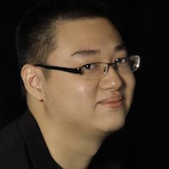

**Undergrad, Nanyang Technological University**

Puay Hiang hopes to build the next Pied Piper.

<https://www.linkedin.com/in/gphofficial/>

---

### Hui Min Toh

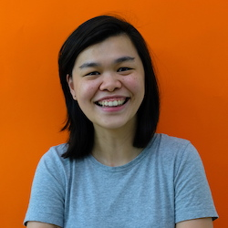

**Frontend engineer, PebbleRoad Pte. Ltd.**

Min is a business analyst turned developer and is currently a frontend engineer with PebbleRoad. She is passionate about the community and contributes where she can. Outside of work, Min tinkers with personal projects to improve and build competency. She also loves her coffee.

Though this program, she hopes to gain insight of the gaps and opportunities as she navigates the landscape and learn from the experience of others.

<https://www.linkedin.com/in/huimintoh/>

---

### Jonathan Louis Ng

**Software Engineer, abillionveg**

---

### Lee Jia Lin

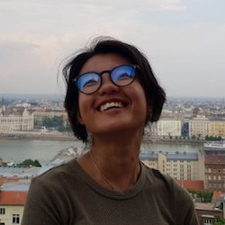

**Software Engineer, Ninja Van**

My name is Jialin, and I currently am at my first full-time job as a software engineer, focusing on frontend and delving deeper into backend at the moment.Most of my job experiences involved working in startups, so if you're in that space, we can share more! I've worked with React (and GatsbyJS!), and dabbled in very light Vue. At the moment, I'm working with Java again for work, specifically with the Play framework. Looking forward to meet everyone!

---

### Lee Wen Yao Peter

**Software developer, School - General assembly**

<https://www.linkedin.com/in/peterleewenyao/>

---

### Muhammad bin Noor Ariffin

**Software Engineer, impress.ai**

---

### Sabrina Tjeng

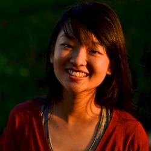

**Software Engineer, SP Digital**

Sabrina accidentally fell in love with programming in university. She is a graduate of the TechLadies and Jumpstart bootcamps and currently works as a full-stack developer at SP Digital.

Through this experience, Sabrina hopes to be exposed to the different types of advice and opinions a senior developer can impart about growing as a developer from a technical perspective, as well as to understand how she can best craft a fulfilling experience as a junior dev for both herself as well as her team mates.

---

### Seah Shih Wei Gerome

**Student, National University of SIngapore**

---

### See Yi Jie

**Aspiring Software Engineer (Final year), Singapore University of Technology and Design**

See Yi Jie, Undergraduate at Singapore University of Technology and Design, Incoming Application Developer at Citi

Yi Jie is an aspiring software engineer and has picked up any suitable technologies/frameworks to get the job done. He fell in love with programming during his first internship at a coding school. Yi Jie feels that building a software is a combination of an art and science. 

He likes reading and learning on long bus and train rides to and from school.
Apart from coding, Yi Jie dances for fun and enjoys playing table tennis.

---

### Sharon Woo

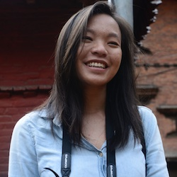

**Research Engineer, Singapore Management University**

Sharon is currently finishing up a part time Masters at SMU. She mostly does scripting for simple analytics, machine learning and deep learning pipelines using Python, and is tryharding at building software in the more traditional sense. Outside of school and work, she likes sleeping and shopping and she really should be running.

---

### Shirlaine Phang 

**Marketing Ops Specialist, ClassPass**

---

### Sujin Lee

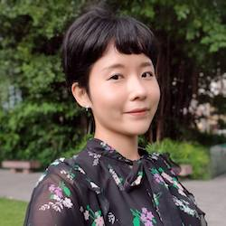

**Web Developer, Singapore Press Holdings**

I am a web developer working on various types of interactive visual stories, data analysis & visualizations projects at the interactive graphics team in the straits times.

Since I started jumping into the programming world, above six technical tutorials and books related to web technologies were translated into Korean by me.

Last year, I got the opportunity to participate on babel.js project throughout Rails Girls Summer Of Code program.
These invaluable experiences, heartwarming communities, and awesome people in tech motivated me to change my career from project manager to developer and keep learning without giving up.

I always believe that vital to the quality of our life is the ability to work together, learn from each other and help others grow.
I hope to learn not only hard skills of technical knowledge and abilities but also soft skills to become a better developer myself from all participants during this program

<https://www.linkedin.com/in/leesujin/>

---

### Tan Hui Tian

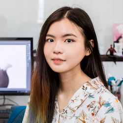

**Junior Front End Web Dev, Smartkarma**

Hui Tian is a junior front end developer at SmartKarma, who switched from a career as a game artist.

---

### Thien su wei

**Adjunct lecturer, Temasek Polytechnic**

---

### Thu Ya Kyaw

**Machine Learning Engineer, NTUC Enterprise**

---

### Vanessa Cassandra

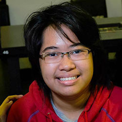

**Front End Engineer, PebbleRoad**

Coming from Electrical Engineering background, Vanessa recently started her journey as a front-end engineer. She loves her job because it allows her to create things that can influence people through their screens. She aspires use this newly-acquired ability to spread good ideas and ~~rule the world~~ make the world a better place.

<https://www.linkedin.com/in/vanessa-cassandra/>

---

### Varick Lim Sheng Rui

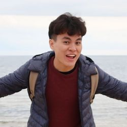

**Software Engineer, Circles.Life**

Hi I'm Varick Lim. I've just recently graduated from NTU and started my journey as a Software Engineer at Circles.Life. I enjoy building web applications and picking up new technologies/frameworks along the way. I believe that a good software engineer should have both hard and soft skills, which I hope to continuously improve upon.

I'm excited to be part of a community where we can learn from one another and grow to become better developers/humans.

<https://www.linkedin.com/in/varicklim/>

---

### Ying Qi Yeoh

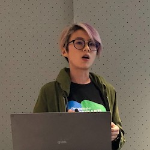

**Product Engineer, Thunes**

Ying Qi spent her career in audit & finance before making the switch to IT. Currently a product engineer at Thunes, she believes in leveraging the power of technology for social good.

---
